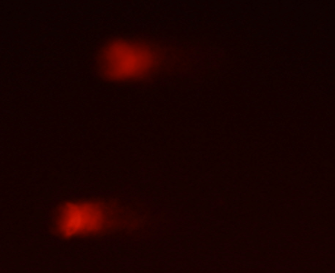
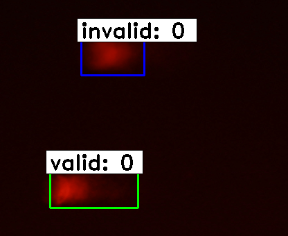
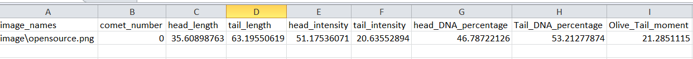

## Comet Analysis 

To run:
```
python test_frcnn.py -p <input_folder_name>
```

The above code takes the DNA comet images from from the input folder and outputs a csv file with 
damage parameters of each damaged comets in the images and prediction image corresponding to each 
image in the input.

Sample image from the open source google images:


Output prediction:


Output CSV:

